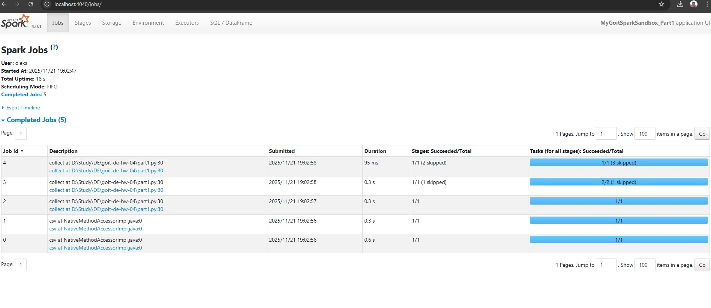
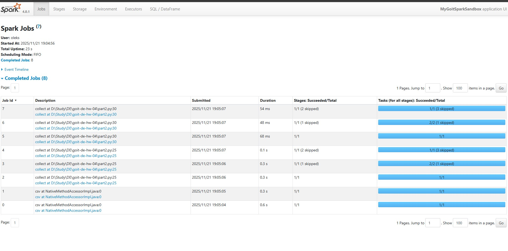
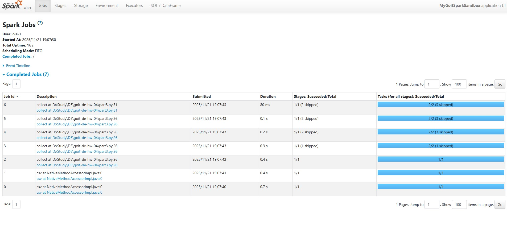

# goit-de-hw-04

Оптимізація та аналіз SparkUI в Apache Spark.

## Опис завдання

Проект реалізує аналіз даних з використанням Apache Spark та PySpark, демонструючи:

-   Вплив додаткових Actions на кількість Jobs
-   Ефективність використання функції `cache()` для оптимізації обробки даних
-   Аналіз SparkUI для розуміння виконання завдань

Робота виконується з CSV-файлом `nuek-vuh3.csv`, який містить дані про пріоритети одиниць.

## Етапи виконання

### Частина 1: Базовий пайплайн (5 Jobs)

**Результат:** 5 Jobs



### Частина 2: З проміжним Action (8 Jobs)

**Результат:** 8 Jobs (на 3 більше, ніж у частині 1)

**Чому на 3 Jobs більше?**

-   Spark виконує весь пайплайн з початку для проміжного `collect()` (5 Jobs)
-   Потім виконує пайплайн знову для фінального `collect()`, але оскільки дані не закешовані, Spark перераховує все з початку (ще 3 Jobs для фільтрації та фінального collect)



### Частина 3: З використанням cache() (7 Jobs)

**Результат:** 7 Jobs (на 1 менше, ніж у частині 2)

**Чому менше Jobs?**

-   Завдяки `cache()`, проміжний результат зберігається в пам'яті після першого обчислення
-   Додаткові операції виконуються на закешованих даних, без повторного обчислення всього пайплайну
-   Це значно прискорює виконання та зменшує навантаження на систему



## Запуск

Для запуску кожної частини окремо:

```bash
# Частина 1
python part1.py

# Частина 2
python part2.py

# Частина 3
python part3.py
```

Після запуску коду відкрийте SparkUI за адресою: http://localhost:4040/jobs/

## Структура проекту

```
goit-de-hw-04/
├── data/
├── screenshots/
│   ├── part1_jobs.jpg
│   ├── part2_jobs.jpg
│   └── part3_jobs.jpg
├── nuek-vuh3.csv
├── part1.py
├── part2.py
├── part3.py
└── README.md
```
